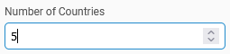

# number-input

A vanilla JS number input component.



## Usage

`npm i @samhuk/number-input`

```typescript
import { createNumberInput } from '@samhuk/number-input'

const element = document.createElement('div')

// Create table with 3 column and 3 rows of data
const numberInput = createNumberInput({
  label: 'Page size',
  page: 1,
  min: 1,
  max: 10,
  step: 1,
})

element.appendChild(numberInput.rendered.element)
```

### Importing Styles

There are two main ways of importing the styles for the component into your project. One can either:

1. `import` the scss entrypoint or css bundle file into your .ts or .js file. This is supported by all the main bundlers out there like webpack and esbuild as long as you have the required loader/plugin for scss or css files configured.
    ```typescript
    // Import the scss entrypoint file from the src
    import 'node_modules/@samhuk/number-input/src/component/styles/index.scss'
    // Import the css bundle file
    import 'node_modules/@samhuk/number-input/dist/styles.css'
    ```
2. `@import` the scss entrypoint file into your scss file.
    ```scss
    @import '~@samhuk/number-input/src/component/styles/index.scss';
    ```

## Development Deployment

One must have node and npm installed. Get node from [nodejs.org](https://nodejs.org/en/download/).

Run `npm i`

Run `npm start`

Try navigating to localhost:4001.
